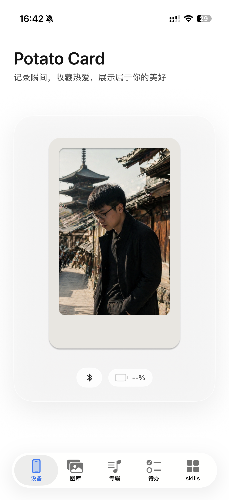
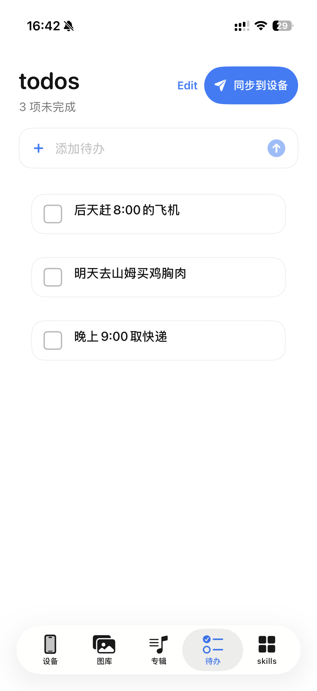
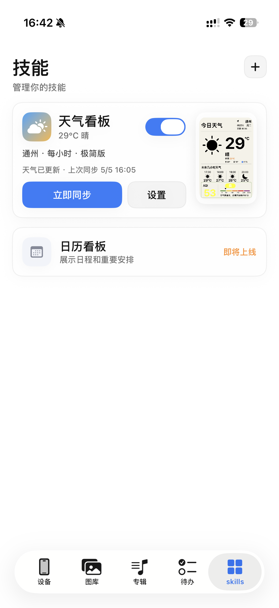

# 🥔 PotatoCardApp

<div align="center">

一个面向 **土豆片 · 6 色墨水屏设备（E-Ink）** 的信息卡片展示 App  
支持高质量图片传输、墨水屏优化显示与快捷指令扩展

<br>


</div>

---

# ✨ 项目简介

PotatoCardApp 是一款专为 **E-Ink 墨水屏设备** 打造的 iOS 应用。

通过对图片、文字与 UI 进行专门优化，使内容在：

- 低刷新率
- 有限色彩
- 特殊显示介质

的情况下依然保持：

- 清晰
- 舒适
- 高级感

适用于：

- 墨水屏信息卡片
- 桌面展示终端
- AI 图片展示
- 个性化 UI 面板

---

# 📸 Screenshots

<div align="center">

| 首页 | 待办 | 技能 |
|------|------|------|
|  |  |  |

</div>

---

# 🎯 使用场景

## 🥔 土豆片设备
面向原创 6 色墨水屏硬件设备（土豆片）

> 硬件作者：@Sunbelife

---

## 🗂 信息卡片
支持展示：

- 天气
- 日程
- 提醒事项
- Todo
- AI 生成图片
- 自定义信息面板

---

## 🎨 个性化终端
可作为：

- 桌面摆件
- 状态显示器
- AI 相框
- 低功耗展示终端

---

# 🚀 核心功能

## 📡 设备连接

- 自动发现附近设备
- 蓝牙快速连接
- 稳定数据传输

---

## 🖼️ 图片处理

- 适配墨水屏分辨率（如 400×600）
- 墨水屏专属显示优化
- 多种图片来源支持
- AI 图片传输支持

---

## 🎨 卡片展示

- 信息卡片 UI
- 动态组件扩展
- SwiftUI 驱动界面

支持扩展：

- 天气
- 日历
- 提醒事项
- AI Skill
- Live Activity

---

## ⚡ 传输优化

- 实时进度反馈
- 后台传输支持
- 快捷指令调用
- 大图片传输优化
- 失败重试机制

---

# 🧱 技术架构

```txt
Swift
SwiftUI
Bluetooth
iOS SDK
E-Ink Device SDK
Shortcuts
Live Activity
```

---

# 🛠️ 快速开始

## 1️⃣ 克隆项目

```bash
git clone https://github.com/jiqimaooo/PotatoCardApp.git
```

---

## 2️⃣ 打开项目

使用 Xcode 打开：

```txt
PotatoCardApp.xcodeproj
```

---

## 3️⃣ 配置签名

在 Xcode 中：

```txt
Signing & Capabilities
→ Team
```

选择自己的 Apple Developer 账号

---

## 4️⃣ 运行项目

连接真机后运行 App

---

# 📁 项目结构

```txt
PotatoCardApp
├── Views          # UI 视图
├── Models         # 数据模型
├── Services       # 蓝牙 / 通信 / 业务逻辑
├── Resources      # 图片与资源
├── Utils          # 工具类
└── Extensions     # 扩展功能
```

---

# ⚠️ 注意事项

- 项目目前仍处于持续开发阶段
- 部分功能依赖真实硬件测试
- 墨水屏显示效果受硬件特性影响
- 后台传输仍在持续优化中

---

# 🔒 隐私与安全

本项目遵循良好的安全实践：

✅ 不包含 API Key / Token  
✅ 不包含证书与敏感配置  
✅ 不包含本地环境文件  
✅ 不采集用户隐私数据  
✅ 不上传用户图片内容  

---

# 🤖 AI 协助开发说明

本项目开发过程中，部分代码与设计由 AI 工具辅助完成，包括但不限于：

- 代码实现
- UI 设计
- 文档编写
- 交互优化
- 调试与问题分析

---

# 🤝 Contributing

欢迎提交：

- Issue
- Pull Request
- 功能建议
- Bug 修复

一起完善 PotatoCardApp ❤️

---

# 📌 PR 提交规范

## ✅ 提交前请确认

- 项目可正常编译
- 不包含无关文件
- 不包含调试代码
- 不包含敏感信息

---

## ❌ 请勿提交

```txt
.DS_Store
DerivedData
本地缓存
构建产物
本地配置文件
```

---

## ✅ PR 说明

请尽量说明：

- 改了什么
- 为什么改
- 影响哪些功能
- 是否存在风险

避免一个 PR 混入多个无关修改。

---

# 🧪 测试要求

涉及以下功能时，请至少完成基础测试：

## 图片 / 蓝牙 / 传输相关

- [ ] 前台传输
- [ ] 后台传输
- [ ] 快捷指令触发
- [ ] 大图片传输
- [ ] 多次连续传输
- [ ] 失败重试
- [ ] 蓝牙断开场景
- [ ] 无新增闪退

---

# 📋 推荐 PR 模板

```md
## 改动内容
- 

## 修复问题
- 

## 测试情况
- [ ] 真机测试
- [ ] 前台传输
- [ ] 后台传输
- [ ] 快捷指令
- [ ] 大图测试
- [ ] 无新增闪退

## 风险说明
- 无
```

---

# 📄 License

## Apache License 2.0

本项目默认遵循 Apache License 2.0 开源协议。

---

## ✅ 免费使用范围

允许：

- 个人学习
- 非商业项目
- 教育用途
- 二次修改
- 非商业分发

但需遵循 Apache 2.0 协议要求。

---

## ⚠️ 商业使用限制

以下行为均视为商业用途：

- 企业内部使用
- 商业项目集成
- 私有化部署
- SaaS 在线服务
- 付费软件
- 商业硬件产品
- 对外收费服务
- 盈利性二次开发

上述行为必须提前获得作者书面授权。

---

## 📮 商业授权联系

如需商业授权，请联系作者。

---

# 🔗 社交链接

## 👨‍💻 项目作者

### 王野 sp

[](https://weibo.com/u/1774818625)

---

## 🥔 原创硬件作者

### Sunbelife

[](https://weibo.com/u/1675423275)

---

<div align="center">

Made with ❤️ by PotatoCardApp

</div>